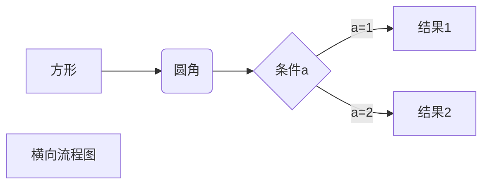

# One Page Blog

## I/O:经典I/O、NIO、NIO2

#### 经典I/O(BIO)
经典I/O的场景是基于文件流的I/O
File对象针对文件做相关操作和RandomAccessFile对文件进行读写操作
InputStream和OuputStream是面向字节流的输入输出
Writer和Reader是面向字符集的输入输出
面向字符和字节的I/O的类基本是类似的

#### NIO
NIO是基于通道和缓冲区的形式进行数据处理的，NIO是双向的
NIO和组成Buffer和Channel

#### NIO2


## 事务、锁、死锁

#### 事务的基本特性

ACID分别是原子性、一致性、隔离性、持久性。

> 原子性（Atomicity）

原子性是指事务包含的所有操作要么全部成功，要么全部失败回滚，因此事务的操作如果成功就必须要完全应用到数据库，如果操作失败则不能对数据库有任何影响。

> 一致性（Consistency）

一致性是指事务必须使数据库从一个一致性状态变换到另一个一致性状态，也就是说一个事务执行之前和执行之后都必须处于一致性状态。举例来说，假设用户A和用户B两者的钱加起来一共是1000，那么不管A和B之间如何转账、转几次账，事务结束后两个用户的钱相加起来应该还得是1000，这就是事务的一致性。

>  隔离性（Isolation）

隔离性是当多个用户并发访问数据库时，比如同时操作同一张表时，数据库为每一个用户开启的事务，不能被其他事务的操作所干扰，多个并发事务之间要相互隔离。关于事务的隔离性数据库提供了多种隔离级别，稍后会介绍到。

> 持久性（Durability）

持久性是指一个事务一旦被提交了，那么对数据库中的数据的改变就是永久性的，即便是在数据库系统遇到故障的情况下也不会丢失提交事务的操作。例如我们在使用JDBC操作数据库时，在提交事务方法后，提示用户事务操作完成，当我们程序执行完成直到看到提示后，就可以认定事务已经正确提交，即使这时候数据库出现了问题，也必须要将我们的事务完全执行完成。否则的话就会造成我们虽然看到提示事务处理完毕，但是数据库因为故障而没有执行事务的重大错误。这是不允许的。

#### 本地事务

在计算机系统中，更多的是通过关系型数据库来控制事务，这是利用数据库本身的事务特性来实现的，因此叫数据库事务，由于应用主要靠关系数据库来控制事务，而数据库通常和应用在同一个服务器，所以基于关系型数据库的事务又被称为本地事务。

#### 分布式事务

随着互联网的快速发展，软件系统由原来的单体应用转变为分布式应用，下图描述了单体应用向微服务的演变：

分布式事务理论依据，DTP模型，XA是DTP模型定义的接口规范，是一个分布式事务协议

> 2PC两段提交协议

`两个阶段`：第一阶段：**投票阶段** 和 第二阶段：**提交/执行阶段**

1）`性能问题`

无论是在第一阶段的过程中,还是在第二阶段,**所有的参与者资源和协调者资源都是被锁住的**,只有当所有节点准备完毕，事务 **协调者** 才会通知进行全局提交，

**参与者** 进行本地事务提交后才会释放资源。这样的**过程会比较漫长，对性能影响比较大**。

2）`单节点故障`

由于**协调者**的重要性，一旦 **协调者** 发生故障。**参与者** 会一直阻塞下去。尤其在第二阶段，**协调者** 发生故障，那么所有的 **参与者** 还都处于

锁定事务资源的状态中，而无法继续完成事务操作。（虽然协调者挂掉，可以重新选举一个协调者，但是无法解决因为协调者宕机导致的参与者处于阻塞状态的问题）

> 3PC三阶段提交

流行的分布式事务方案：

Saga， TCC， Seata

> Saga

针对每个服务的提交事务都要对应一个回滚事务，需要对业务进行改造

事务提交：微服务本地事务提交

事务回滚：微服务补偿机制回滚

事务协调：事务协作机制（编排式和协调式）

流程编排模式优点简单，松耦合，缺点难以理解，可能的循环依赖，紧密结合的风险

saga只满足ACD

https://zhuanlan.zhihu.com/p/95608046

https://zhuanlan.zhihu.com/p/142128504

https://zhuanlan.zhihu.com/p/78269431

https://kkovacs.eu/cassandra-vs-mongodb-vs-couchdb-vs-redis/


### 锁

https://www.cnblogs.com/dayao666/p/13177735.html

#### 乐观锁和悲观锁

乐观锁和悲观锁是预测并发访问数据发生冲突时使用的手段

悲观锁认为冲突是时刻存在的，通过排他方式阻止冲突的发生

悲观锁任务冲突是偶发的，先操作，发生冲突就采取重试的策略

#### CAS：比较及交换

其实也属于原子操作，但它是非阻塞的，所以在被操作值被频繁变更的情况下,CAS操作并不那么容易成功，不得不利用for循环以进行多次尝试。

#### 自旋锁(spinlock)

自旋锁是指当一个线程在获取锁的时候，如果锁已经被其他线程获取，那么该线程将循环等待，然后不断地判断是否能够被成功获取，知直到获取到锁才会退出循环。获取锁的线程一直处于活跃状态 自旋锁用来实现其他类型的锁,与互斥锁类似，不同点在于，它不是通过休眠来使进程阻塞，而是在获得锁之前一直处于活跃状态(自旋)。

#### https://www.cnblogs.com/javastack/p/12935691.html


## Java字节码增强技术

ava字节码增强指的是**在Java字节码生成之后，对其进行修改**，增强其功能，这种方式相当于对应用程序的二进制文件进行修改。Java字节码增强主要是为了减少冗余代码，提高性能等。

### Java注解

###编译时

javac执行注解处理器

### 运行时

通过反射读取注解信息


## Java并发

### Java竞态条件

Java中的 **竞态条件** 是一种并发错误或问题，它是在您的程序中引入的，因为您的程序在多个线程同时并行执行  。当两个线程 在没有正确同步的同一对象上操作并且操作彼此交错 时，就会出现 **竞态条件**，临界区指：导致竞态条件发生的代码区

```java
@NotThreadSafe
public class LazyInitRace {
    private ExpensiveObject instance = null;
    public ExpensiveObject getInstance() {
        if (instance == null)
					instance = new ExpensiveObject();
				return instance;
    } 
}
```

多个线程同时执行单例的延迟加载时,会产生竞态，会发生返回的实例不是同一个实例的情况，如果这个单例存储重要数据，就会造成不一致的情况。这里的临界区就对单例的初始化判断

### Java并发基础

并发数据结构：阻塞型数据结构和非阻塞型数据结构

* 可见性

  一个线程多变量的修改对另外一个线程是不可见的，这是由于计算机CPU的多级缓存引起的，JMM的内存模型是对这一模型的简化

* 原子性 

### Java线程安全

线程安全是指多线程情况下对java数据访问的一致性安全，

非线程安全是指在多线程情况下，对数据访问可能出现的不一致性问题。

#### 线程安全的实现

要实现线程安全，就要在多线程访问数据的情况下达到线程间数据的同步，或者避免多线程多数据的访问

> 使用Jvm提供的线程同步工具

* synchronized(代码块的同步)
* volatile修饰符(数据访问不经过寄存器，直接在主存级别)，不保证原子性，可用于条件判断
* 显式锁
* 原子变量

> 避免多线程的数据访问修改，既线程数据间的共享

* 局部变量的使用（线程栈只对线程可见）
* 使用不可变变量和无状态对象
* threadLocal的使用
* 线程独占对应，线程池获取对象


### threadLocal源码分析

ThreadLocal是Thread的局部变量，能解决线程使用安全对象，又不加锁的需求

ThreadLocalMap是线程变量存储的真正对象

```java
public T get() {
    Thread t = Thread.currentThread();
    ThreadLocalMap map = getMap(t);
    if (map != null) {
        ThreadLocalMap.Entry e = map.getEntry(this);
        if (e != null) {
            @SuppressWarnings("unchecked")
            T result = (T)e.value;
            return result;
        }
    }
    return setInitialValue();
}
```

在获取线程局部变量的情况下，线程的ThreadLocalMap属性为空，回调用setInitialValue方法进行初始化

```java
private T setInitialValue() {
    T value = initialValue();
    Thread t = Thread.currentThread();
    ThreadLocalMap map = getMap(t);
    if (map != null)
        map.set(this, value);
    else
        createMap(t, value);
    return value;
}
```

针对每个线程都会创建自己的ThreadLocalMap属性，来存储局部变量，用空间解决变量共享问题

Thread.threadLocals属性存放ThreadLocalMap对象

ThreadLocalMap => [ThreadLocal => Entry[ThreadLocal的弱引用, value]]

Entry的ThreadLocal是WeakReference，如果ThreadLocal被回收，ThreadLocal的弱引用会被回收重置为null，会导致对应value值无法被回收


## Java线程和线程池

###Java线程

程序线性处理任务，无法充分利用计算机多核的能力。这时候可以用多进程能有效解决这个问题。高并发应用通常都会充分发挥多CPU的计算能力。**Java中线程的本质，其实就是操作系统中的线程**。线程模型的资源消耗更少，线程也是JAVA编程的标配，JVM也应用了很多，GC回收就是独立的线程进行的。

线程使用不单容易造成JVM虚拟机资源的耗尽，超过系统对底层的限制也会造成OOM的问题，频繁创建线程的开销也非常大。

```java
Exception in thread "main" java.lang.OutOfMemoryError: unable to create new native thread
at java.lang.Thread.start0(Native Method)
at java.lang.Thread.start(Thread.java:714)
```

JVM可创建线程数受到分配的内存数影响，可以用-Xms -Xmx-Xmn 这几个参数调节，但也受到计算机关联配置的影响。所以任何不当的编程都会导致服务器的问题出现，自然java也为我们提供了有效的解决方案。

### Java线程生命周期

线程运行

线程终止

### Java线程池框架

#####Executors框架能直接调用静态构造方法创建配置好的线程池:

1.创建单线程线程池，能确保存在一个线程

```java
Executor singleThreadExecutor = Executors.newSingleThreadExecutor();
```

2.创建可缓存的线程池，任务超过线程数时，会回收空闲的线程

```java
Executor cachedThreadPool = Executors.newCachedThreadPool();
```

3.创建固定线程数的线程池，任务超过线程数，线程规模也不会增加

```java
Executor fixedThreadPool = Executors.newFixedThreadPool(10);
```

4.线程数等于CPU数，每个线程要处理分配队列中的任务，如果完成自己队列中的任务，那么它可以去其他线程中获取其他线程的任务去执行

```java
Executor workStealingPool = Executors.newWorkStealingPool();
```

5.创建固定长度的线程池，以时间调度的方式执行

```java
Executor scheduledThreadPool = Executors.newScheduledThreadPool(10);
```

6.创建单线程的线程池，以时间调度的方式执行

```java
Executor singleThreadScheduledExecutor = Executors.newSingleThreadScheduledExecutor();
```

##### ThreadPoolExecutor构造函数

虽然上述的预配置好的线程池能满足我们很大一部分需求，但可以通过 ThreadPoolExecutor 的构造函数进行定制实例化

```java
public ThreadPoolExecutor(int corePoolSize,
                          int maximumPoolSize,
                          long keepAliveTime,
                          TimeUnit unit,
                          BlockingQueue<Runnable> workQueue,
                          ThreadFactory threadFactory,
                          RejectedExecutionHandler handler)
```

构造函数参数：

* corePoolSize 线程池基本大小，即使线程空闲也会保存基本线程，除非allowCoreThreadTimeOut设置
* maximumPoolSize 线程池最大线程数，
* keepAliveTime 空闲线程存活时间，继超过核心线程数线程最大空闲存活时间
* unit 时间单位
* workQueue 任务队列（无界队列，有界队列，同步移交）
* threadFactory 线程构造工厂
* handler 线程饱和策略

重要参数介绍：

> workQueue 队列的选择对提交的任务管理非常重要，合适的队列选择关乎到应用的稳定

无界队列LinkedBlockingDeque，可以无限的增加提交的任务

有界队列ArrayBlockingQueue，队列填满之后会启动线程饱和策略处理	 

同步移交 线程之间移交的机制

> threadFactory 是作为线程池构造线程调用的，默认框默认的线程工厂代码

```JAVA
static class DefaultThreadFactory implements ThreadFactory {
    private static final AtomicInteger poolNumber = new AtomicInteger(1);
    private final ThreadGroup group;
    private final AtomicInteger threadNumber = new AtomicInteger(1);
    private final String namePrefix;

    DefaultThreadFactory() {
        SecurityManager s = System.getSecurityManager();
        group = (s != null) ? s.getThreadGroup() :
                              Thread.currentThread().getThreadGroup();
        namePrefix = "pool-" +
                      poolNumber.getAndIncrement() +
                     "-thread-";
    }

    public Thread newThread(Runnable r) {
        Thread t = new Thread(group, r,
                              namePrefix + threadNumber.getAndIncrement(),
                              0);
        if (t.isDaemon())
            t.setDaemon(false);
        if (t.getPriority() != Thread.NORM_PRIORITY)
            t.setPriority(Thread.NORM_PRIORITY);
        return t;
    }
}
```

> 饱和策略是用于处理有界队列被填满的情况

AbortPolicy 中止策略，默认的饱和策略，超过队列，会抛出异常

DiscardPolicy 抛弃策略，会抛弃无法执行的任务

DiscardOldestPolicy 抛弃最旧策略，会抛弃下一个将执行的任务，并且尝试重新提交新任务

CallerRunsPolicy 调用者模式, 队列饱和之后，该策略既不会丢弃任务和抛出异常，会转而给调用线程（通常是主线程）执行任务

#####ThreadPoolExecutor的钩子函数

可以通过ThreadPoolExecutor提供的钩子函数，来扩展ThreadPoolExecutor

* beforeExecute
* afterExecute
* terminated

### Java线程池原理

任务->工作线程->工作队列

> 线程池初始化

创建线程池，初始化基本参数，不做其他额外工作

> 线程池框架调用

添加工作任务，由于工作线程数小于核心线程数，会创建核心工作线程，如果已经超过工作线程限制，不再创建新的工作线程，将任务添加到工作队列，工作线程添加成功，开始执行工作线程

```java
public void execute(Runnable command) {
    if (command == null)
        throw new NullPointerException();
    /*
     * Proceed in 3 steps:
     *
     * 1. If fewer than corePoolSize threads are running, try to
     * start a new thread with the given command as its first
     * task.  The call to addWorker atomically checks runState and
     * workerCount, and so prevents false alarms that would add
     * threads when it shouldn't, by returning false.
     *
     * 2. If a task can be successfully queued, then we still need
     * to double-check whether we should have added a thread
     * (because existing ones died since last checking) or that
     * the pool shut down since entry into this method. So we
     * recheck state and if necessary roll back the enqueuing if
     * stopped, or start a new thread if there are none.
     *
     * 3. If we cannot queue task, then we try to add a new
     * thread.  If it fails, we know we are shut down or saturated
     * and so reject the task.
     */
    int c = ctl.get();
    if (workerCountOf(c) < corePoolSize) {
        if (addWorker(command, true))
            return;
        c = ctl.get();
    }
    if (isRunning(c) && workQueue.offer(command)) {
        int recheck = ctl.get();
        if (! isRunning(recheck) && remove(command))
            reject(command);
        else if (workerCountOf(recheck) == 0)
            addWorker(null, false);
    }
    else if (!addWorker(command, false))
        reject(command);
}
```

> 工作线程运行

工作线程循环检查任务队列并执行

```java
final void runWorker(Worker w) {
    Thread wt = Thread.currentThread();
    Runnable task = w.firstTask;
    w.firstTask = null;
    w.unlock(); // allow interrupts
    boolean completedAbruptly = true;
    try {
        while (task != null || (task = getTask()) != null) {
            w.lock();
            // If pool is stopping, ensure thread is interrupted;
            // if not, ensure thread is not interrupted.  This
            // requires a recheck in second case to deal with
            // shutdownNow race while clearing interrupt
            if ((runStateAtLeast(ctl.get(), STOP) ||
                 (Thread.interrupted() &&
                  runStateAtLeast(ctl.get(), STOP))) &&
                !wt.isInterrupted())
                wt.interrupt();
            try {
                beforeExecute(wt, task);
                try {
                    task.run();
                    afterExecute(task, null);
                } catch (Throwable ex) {
                    afterExecute(task, ex);
                    throw ex;
                }
            } finally {
                task = null;
                w.completedTasks++;
                w.unlock();
            }
        }
        completedAbruptly = false;
    } finally {
        processWorkerExit(w, completedAbruptly);
    }
}
```

工作线程获取任务逻辑

```java
private Runnable getTask() {
    boolean timedOut = false; // Did the last poll() time out?

    for (;;) {
        int c = ctl.get();

        // Check if queue empty only if necessary.
        if (runStateAtLeast(c, SHUTDOWN)
            && (runStateAtLeast(c, STOP) || workQueue.isEmpty())) {
            decrementWorkerCount();
            return null;
        }

        int wc = workerCountOf(c);

        // Are workers subject to culling?
        boolean timed = allowCoreThreadTimeOut || wc > corePoolSize;

        if ((wc > maximumPoolSize || (timed && timedOut))
            && (wc > 1 || workQueue.isEmpty())) {
            if (compareAndDecrementWorkerCount(c))
                return null;
            continue;
        }

        try {
            Runnable r = timed ?
                workQueue.poll(keepAliveTime, TimeUnit.NANOSECONDS) :
                workQueue.take();
            if (r != null)
                return r;
            timedOut = true;
        } catch (InterruptedException retry) {
            timedOut = false;
        }
    }
}
```

### Java调度线程池框架

ScheduledThreadPoolExecutor继承ThreadPoolExecutor了,借助线程池框架的功能，能很好代替Timer的功能权限，用来执行延迟任务和周期任务

| Timer                                            | ScheduledThreadPoolExecutor            |
| ------------------------------------------------ | -------------------------------------- |
| 单线程                                           | 多线程                                 |
| 单个任务执行时间影响其他任务调度                 | 多线程，不会影响                       |
| 基于绝对时间                                     | 基于相对时间                           |
| 一旦执行任务出现异常不会捕获，其他任务得不到执行 | 多线程，单个任务的执行不会影响其他线程 |

>  线程池初始化，使用DelayedWorkQueue作为任务队列

```java
public ScheduledThreadPoolExecutor(int corePoolSize,
                                       ThreadFactory threadFactory,
                                       RejectedExecutionHandler handler) {
        super(corePoolSize, Integer.MAX_VALUE,
              DEFAULT_KEEPALIVE_MILLIS, MILLISECONDS,
              new DelayedWorkQueue(), threadFactory, handler);
    }
```

> 线程池执行任务，添加到延迟队列中

```java
public ScheduledFuture<?> schedule(Runnable command,
                                   long delay,
                                   TimeUnit unit) {
    if (command == null || unit == null)
        throw new NullPointerException();
    RunnableScheduledFuture<Void> t = decorateTask(command,
        new ScheduledFutureTask<Void>(command, null,
                                      triggerTime(delay, unit),
                                      sequencer.getAndIncrement()));
    delayedExecute(t);
    return t;
}
```

> 获取队列元素

```java
public RunnableScheduledFuture<?> poll() {
    final ReentrantLock lock = this.lock;
    lock.lock();
    try {
        RunnableScheduledFuture<?> first = queue[0];
        return (first == null || first.getDelay(NANOSECONDS) > 0)
            ? null
            : finishPoll(first);
    } finally {
        lock.unlock();
    }
}

public RunnableScheduledFuture<?> take() throws InterruptedException {
    final ReentrantLock lock = this.lock;
    lock.lockInterruptibly();
    try {
        for (;;) {
            RunnableScheduledFuture<?> first = queue[0];
            if (first == null)
                available.await();
            else {
                long delay = first.getDelay(NANOSECONDS);
                if (delay <= 0L)
                    return finishPoll(first);
                first = null; // don't retain ref while waiting
                if (leader != null)
                    available.await();
                else {
                    Thread thisThread = Thread.currentThread();
                    leader = thisThread;
                    try {
                        available.awaitNanos(delay);
                    } finally {
                        if (leader == thisThread)
                            leader = null;
                    }
                }
            }
        }
    } finally {
        if (leader == null && queue[0] != null)
            available.signal();
        lock.unlock();
    }
}
```

### ForkJoinPool 线程框架

**forkJoinPool**的优势在于，可以充分利用多cpu，多核cpu的优势，把一个任务拆分成多个“小任务”，把多个“小任务”放到多个处理器核心上并行执行；当多个“小任务”执行完成之后，再将这些执行结果合并起来即可,forkJoinPool线程池为了提高任务的并行度和吞吐量做了非常多而且复杂的设计实现。

 `fork()` 和 `join()` 的作用：

- `fork()`：开启一个新线程（或是重用线程池内的空闲线程），将任务交给该线程处理。
- `join()`：等待该任务的处理线程处理完毕，获得返回值。


所谓**work-stealing模式**，即每个工作线程都会有自己的任务队列。当工作线程完成了自己所有的工作后，就会去“偷”别的工作线程的任务。


**ForkJoinPool与ThreadPoolExecutor区别：**

1.ForkJoinPool中的每个线程都会有一个队列，而ThreadPoolExecutor只有一个队列，并根据queue类型不同，细分出各种线程池

2.ForkJoinPool能够使用数量有限的线程来完成非常多的具有父子关系的任务,ThreadPoolExecutor中根本没有什么父子关系任务

3.ForkJoinPool在使用过程中，会创建大量的子任务，会进行大量的gc，但是ThreadPoolExecutor不需要，因此单线程（或者任务分配平均）

4.ForkJoinPool在多任务，且任务分配不均是有优势，但是在单线程或者任务分配均匀的情况下，效率没有ThreadPoolExecutor高，毕竟要进行大量gc子任务

 

ForkJoinPool在多线程情况下，能够实现工作窃取(Work Stealing)，在该线程池的每个线程中会维护一个队列来存放需要被执行的任务。当线程自身队列中的任务都执行完毕后，它会从别的线程中拿到未被执行的任务并帮助它执行。

ThreadPoolExecutor因为它其中的线程并不会关注每个任务之间任务量的差异。当执行任务量最小的任务的线程执行完毕后，它就会处于空闲的状态(Idle)，等待任务量最大的任务执行完毕。

因此多任务在多线程中分配不均时，ForkJoinPool效率高。


# Java知识

### Java类型

java有基础类型和引用类型

> 基础类型

Java语言提供了八种基本类型。六种数字类型（四个整数型byte, short, int, long, ，两个浮点型 double, float），一种字符类型(char)，还有一种布尔型bool。

> 引用类型

引用类型则包括类（class)、接口(interface)、数组([])、枚举(enum、String)等

还提供了基础类型的包装类 Byte, Short, Integer, Long, Double, Float, Character, Boolean

自动拆装箱是指编译器对包装类型和非包装类型之前的自动转换，类如Integer.valueof(int)

包装类型是引用类型因此存在null的情况，基础类型不存在null的情况，基础类型的值可能性要比相对应的包装类型少，函数内部可以直接使用基础类型

#### String、StringBuffer、StringBuilder区别

String:字符串常量，不适用于经常要改变值得情况，每次改变相当于生成一个新的对象，注意点JVM的优化，字符串常量获取是相同的，因为有常量池的存在

StringBuffer:字符串变量 （线程安全的实现, 增加了synchronized机制）

StringBuilder:字符串变量（线程不安全） 确保单线程下可用，效率略高于StringBuffe

String不能滥用，能用具体的类型就应该用具体的类型

#### Boolean包装类

提供了静态方法直接构造Boolean对象

```java
public static Boolean valueOf(boolean b) {
    return (b ? TRUE : FALSE);
}
```

### Java基础对象

```java
public class Object {
    public Object() {
    }

    private static native void registerNatives();

    // 获取类信息
    public final native Class<?> getClass();
    
    // 基础方法
    public native int hashCode();

    public boolean equals(Object var1) {
        return this == var1;
    }

    protected native Object clone() throws CloneNotSupportedException;

    public String toString() {
        return this.getClass().getName() + "@" + Integer.toHexString(this.hashCode());
    }
  
    protected void finalize() throws Throwable {
    }

    // 线程使用
    public final native void notify();

    public final native void notifyAll();

    public final native void wait(long var1) throws InterruptedException;

    public final void wait(long var1, int var3) throws InterruptedException {
        if (var1 < 0L) {
            throw new IllegalArgumentException("timeout value is negative");
        } else if (var3 >= 0 && var3 <= 999999) {
            if (var3 > 0) {
                ++var1;
            }

            this.wait(var1);
        } else {
            throw new IllegalArgumentException("nanosecond timeout value out of range");
        }
    }

    public final void wait() throws InterruptedException {
        this.wait(0L);
    }

    static {
        registerNatives();
    }
}
```


对象clone方法都是浅拷贝，只拷贝源对象地址，深拷贝要自己实现

深拷贝方法：构造函数， 重载clone，序列化反序列化生成

对象自定义比较需要实现Comparable


#### Java引用

引用关系由强到弱

* 强引用：只要引用还存在，就不会被GC

* 软引用：无足够内存，GC前会进行回收的对象

* 弱引用：只能存活到下次GC

* 虚引用：随时都能被GC的引用

### Jvm GC

GC分代假说

* 弱分代假说：绝大多数对象都是朝生夕死
* 强分代假说：经过越多次GC越难以消亡
* 跨分代假说：跨分代引用是少数存在的

GC分代收集

* 老生代收集
* 新生代收集
* 混合收集
* 整堆收集

GC收集算法

* 标记清除
* 标记复制
* 标记整理

Jvm可达性分析-GCroots对象

* 虚拟栈中的引用的对象
* 方法区中类静态属性引用的对象
* 方法区中常量引用的对象
* 本地方法栈中Native引用的对象

Jvm的GC收集器

* 新生代收集器: Serial(单线程)    PartNew(并行,已经被合并到CMS)  Parallel
* 老年代收集器: Serial_Old  Parallel_Old  CMS
* 整堆收集器: G1 
* 实验性低延迟收集器：Shenandoan ZGC


### 使用反射、动态代理、CGLib等


### Jvm架构

JVM虚拟机运行时数据区域


### Jvm实现class文件语意的两种方式：

·将输入的Java虚拟机代码在加载时或执行时翻译成另一种虚拟机的指令集；

·将输入的Java虚拟机代码在加载时或执行时翻译成宿主机处理程序的本地指令集（即即时编译器代码生成技术）


#### 运行时数据区监控实现

https://mp.weixin.qq.com/s/41v2pyYx9kLthJGjyR9-iw

https://zhuanlan.zhihu.com/p/91861220

https://cloud.tencent.com/developer/article/1695640

JMM内存模型

JVM线程模型

### Java标准库:集合类

### Java标准库:网络net

### Java标准库:并发current库

#### 并发同步机制

> AbstractQueuedSynchronizer

* ReentrantLock

* ReadWriteLock

* ReentrantReadWriteLock

* CountDownLatch

* CyclicBarrier

* CountedCompleter

* Semaphore

  Semaphore 是 synchronized 的加强版，作用是控制线程的并发数量

> StampedLock

#### 

####原子变量类

| 原子变量类             | 名称               | 底层结构 |
| ---------------------- | ------------------ | -------- |
| AtomicBoolean          | 布尔值原子变量     | Booean   |
| AtomicInteger          | 整数原子变量       | int      |
| AtomicIntegerArray     | 整形数组原子变量   | int[]    |
| AtomicLong             | 长整型原子变量     | long     |
| AtomicLongArray        | 长整型数组原子变量 | long[]   |
| AtomicReference        | 引用原子变量       | object   |
| AtomicReferenceArray   | 引用数组原子变量   | Object[] |
| AtomicStampedReference | 时间戳原子变量     | Pair<V>  |

基于CAS的实现方式


#### 线程安全集合

* ConcurrentHashMap
* ConcurrentLinkedDeque
* ConcurrentLinkedQueue
* ConcurrentSkipListMap
* ConcurrentSkipListSet
* CopyOnWriteArrayList
* CopyOnWriteArraySet


### Java标准库:工具util

### Java Spi, Spring Spi, Dubbo Spi

SPI全称Service Provider Interface，是Java提供的一套用来被第三方实现或者扩展的接口，它可以用来启用框架扩展和替换组件
只要按照SPI的约定编写接口和对应实现类和配置文件，就能自动加载对应的服务提供实现

1. 在META-INF/services/ 目录中创建以接口全限定名命名的文件，该文件内容为API具体实现类的全限定名
2. 使用ServiceLoader类动态加载 META-INF 中的实现类
3. 如 SPI 的实现类为 Jar 则需要放在主程序 ClassPath 中
4. API 具体实现类必须有一个不带参数的构造方法

#### 服务接口类

```java
package com.sz.spi;
/**
 * @author sunze
 * @date 2020/10/9
 */
public interface Log {

    /**
     * 打印日志信息
     * @param str
     */
    void info(String str);
}
```
#### 实现类

```java
package com.sz.impl;
import com.sz.spi.Log;
/**
 * @author sunze
 * @date 2020/10/9
 */
public class TestLog implements Log {
    @Override
    public void info(String s) {
        System.out.println("Test:" + s);
    }
}
```
#### 实现类

```java
package com.sz.impl;
import com.sz.spi.Log;

/**
 * @author sunze
 * @date 2020/10/9
 */
public class DevLog implements Log {
    @Override
    public void info(String s) {
        System.out.println("Dev:" + s);
    }
}
```
#### 测试类

```java
package com.sz;
import com.sz.spi.Log;
import java.util.Iterator;
import java.util.ServiceLoader;

/**
 * @author sunze
 * @date 2020/10/9
 */
public class SpiTest {
    public static void main(String[] args) {
        ServiceLoader<Log> peoples = ServiceLoader.load(Log.class);
        Iterator<Log> iterator = peoples.iterator();
        while (iterator.hasNext()) {
            Log log = iterator.next();
            log.info("hellow wolrd");
        }
    }
}
```
运行结果：
Test:hellow wolrd
Dev:hellow wolrd

### Java原生调用

### Java内部类

java内部类是在类中声明了其他类，java内部类形式：

* 静态成员类
* 非静态成员类
* 局部类
* 匿名类

### Java范型

范型的特性集中在三个方面：

##### **范型类**

##### **范型方法**


##### 范型通配符

范型无界通配符和范型有界通配符

在特定情况下，我们可能并不关心范型具体的类型，它可以是某个确定的类型就行了，这时候可以用到通配符，不要用原生类型会造成没有编译期的检查导致潜在的运行错误。

> 应用例子

```java
static int numElementsInCommon(Set<?> s1, Set<?> s2) { ... }
```

##### 范型实现-擦除

### Java枚举类

java枚举类提供了类空间的枚举单例

### JVM性能调优

##### Java工具

> 命令行工具

* jps：显示运行中的java进程

  ​	 jps -l 显示java进程

* jstat：虚拟机运行状态监控工具

  ​	stat -gc [vmid] 

* jinfo:  查询虚拟机各项启动参数和配置

  ​	jinfo   [vmid] 

* jmap:  java内存映射工具

  ​	jmap -dump:format=b,file=[file]  [vmid]

* jstack: jvm堆栈快照

  ​	jstack [vmid]

> 可视化工具

* jhsdb (jdk11)：服务代理调试工具
* Jconsole：Java监控与管理工具
* visualVm:多合故障处理工具
* JmissionConsole:可持续在线监控处理工具

工具:jstat、jmap、jstack、jinfo


### Jvm开放的接口


# 云原生技术

云原生让分布式服务端系统成为可能，能简单的管控计算资源，只需要将计算机加入k8s作为集群node

| 单机系统         | k8s分布式系统      |
| ---------------- | ------------------ |
| 进程             | 应用系统           |
| 单应用           | 分布式             |
| 进程间通信       | 网络间通信         |
| 资源管控能力有限 | 统一的资源管控     |
| 文件系统         | PV/PVC             |
| 计算能力有限     | 计算能力理论上无限 |
| 单机硬件         | 集群机器           |

### Kubernetes

k8s解决了分布式应用的管理问题

#### Kubernetes组成

> Master节点组件控制节点，主节点，负责管理集群状态
* etcd配置存储
* API服务器
* 调度器
* 控制器管理器
> Node节点的组件, 运行在工作node上
* Kubelete 管理pod
* kube-proxy 网络通信和负载
* 运行容器 
> 附加组件
* Kubernetes的DNS服务器
* 控制台
* Ingress控制器
* 监控工具
* 容器网络插件
Kubernetes架构图


> pod的生命周期

- Pending：表示pod已经被同意创建，正在等待kube-scheduler选择合适的节点创建，一般是在准备镜像；
- Running：表示pod中所有的容器已经被创建，并且至少有一个容器正在运行或者是正在启动或者是正在重启；
- Succeeded：表示所有容器已经成功终止，并且不会再启动；
- Failed：表示pod中所有容器都是非0（不正常）状态退出；
- Unknown：表示无法读取Pod状态，通常是kube-controller-manager无法与Pod通信

#### Kubernetes资源限制

> Qos服务质量等级
>
> * (低) BestEffort 最大努力
> * (中) Burstable 
> * (高) Guaranteed保证

> ResourceQuota
>
> 命名空间资源配额

pod资源使用超出node资源时， 会对低服务质量等级的容器内进程进行kill操作

#### Kubernetes核心理念

> kubernetes的pod健康检查(liveness probees)
* HTTP GET获取POD状态
* TCP Socket状态检查
* Exec 命令方式 
> kubernetes的pod准备检查(readiness probe)
* HTTP GET获取POD状态
* TCP Socket状态检查
* Exec 命令方式

> kubernetes的services
k8s的pod的ip是可变不固定的，多pod的ip也不同，需要service作为固定唯一的访问入口
集群内部service访问:添加selector, 环境变量和FQDN
集群外部service访问:不指定selector, 创建endpoints资源关联外部集群外部服务ip:port

> kubernetes的外网访问机制
k8s尽开放了pod间的相互访问，pod的ip对外部是不可见的，外网访问需要固定的ip入口，外网访问k8s的机制有一下几种
* NodePort(重定向外部请求包到service,可以通过node的ip访问service)
* LoadBalancer(NodePort的扩展类型) 
* Ingress(HTTP网络层) 

> kubernetes的服务访问异常排查
1. 集群内部访问服务集群IP
2. 确保pod的健康检查是OK的
3. 确认pod是服务的一部分，检查服务的endpoint
4. 通过FQDN访问确保是正确的
5. 确认你连接的是服务的port而部署目标port

> kubernetes的无状态控制器
* ReplicationController[已废弃]
* ReplicaSets(Pod模版, 标签选择，Pod数)
* DaemonSet(一个Node一个Pod)
* Job/CronJob
* Deployment
> kubernetes的有状态控制器
> kubernetes的自定义控制器

> kubernetes的volumn
用来挂载持久化的数据
* emptyDir在pod的容器中共享，pod删除后一起消失
* hostpath在node节点上的目录
* gitRepo获取git内容
* PVC屏蔽了PV的多样性，提供了一致的接口
动态数据传递, 命令行和环境变量无法避免去修改k8s的pod资源文件, 配置和密码将动态的数据从镜像抽离出来，减少不必要的镜像重构和维护
* 命令行command和args
* 环境变量env
* ConfigMap
ConfigMap用键值的方式保存配置, 可以通过字面量设置，可以读取文件设置, 也可以读取文件夹设置
ConfigMap可以作为容器环境变量读取,也可以作为文件挂载到容器 
ConfigMap的修改会更新到容器里面，避免了容器的重新启动
* Secrets
用来存储敏感信息，不会落磁盘文件

> kubernetes的应用
kubernetes用四种资源组成一个应用（workloads, loadbalance, service, volumes)

### Docker
####ENTRYPOINT和CMD的区别
ENTRYPOINT会在容器启动时执行，不会被覆盖
CMD在启动运行容器时执行，可以在docker run时覆盖执行命令
####ADD和COPY的区别
功能都是将文件添加到镜像，ADD会多其他功能，针对tar的压缩文件会解压, 从url拷贝文件到镜像中

#### Docker工具

skopeo， kaniko， s2i

### 云原生应用的好处

* CICD系统集成
* 应用伸缩和扩容
* 统一的基础设施建设


### 容器工作流引擎（Argo）


#### Argo介绍

#### Argo CLI

```shell
	archive
  auth
  completion  output shell completion code for the specified shell (bash or zsh)
  cron        manage cron workflows
  delete			删除工作流流
  get         获取工作流详细信息 display details about a workflow
  help        获取版主命令 Help about any command
  lint        验证工作流文件 validate files or directories of workflow manifests
  list        列出所有工作流 list workflows
  logs        查看日志 view logs of a pod or workflow
  resubmit    重新提交工作流 resubmit one or more workflows
  resume      恢复工作流 resume zero or more workflows
  retry       重试工作流 retry zero or more workflows
  server      启动argo服务 Start the Argo Server
  stop        停止工作流 stop zero or more workflows
  submit      提交工作流 submit a workflow
  suspend     暂停工作流 suspend zero or more workflow
  template    操作工作流模版 manipulate workflow templates
  terminate   终止工作流 terminate zero or more workflows
  version     打印版本信息
  wait        等待工作流到结束
  watch       监控工作流到结束
```

argo是作为k8s原生支持的流程编排扩展，Argo CLI相对kubectl提供语法检查和更少的输出和更简洁的命令

```shell
argo submit hello-world.yaml    # submit a workflow spec to Kubernetes
argo list                       # list current workflows
argo get hello-world-xxx        # get info about a specific workflow
argo logs -w hello-world-xxx    # get logs from all steps in a workflow
argo logs hello-world-xxx-yyy   # get logs from a specific step in a workflow
argo delete hello-world-xxx
```

argo工作流规范参数

```yaml
apiVersion: argoproj.io/v1alpha1
kind: Workflow
metadata:
  generateName: hello-world-parameters-
spec:
  # invoke the whalesay template with
  # "hello world" as the argument
  # to the message parameter
  entrypoint: whalesay
  arguments:
    parameters:
    - name: message
      value: hello world

  templates:
  - name: whalesay
    inputs:
      parameters:
      - name: message       # parameter declaration
    container:
      # run cowsay with that message input parameter as args
      image: docker/whalesay
      command: [cowsay]
      args: ["{{inputs.parameters.message}}"]
```

whalesay模版获取一个message输入参数，作为cowsay命令的参数，参数表示必须用双引号，argo也支持

>  Steps

定义资源的执行步骤

>  DAG

directed-acyclic graph, 可选的定义执行顺序的方法，用来描述复杂的工作流以及相互之间的依赖关系

>  Artifacts

能作为容器执行的输出结果artifacts

> Secrets

argo支持Kubernetes一样的secrets语法

>  Scripts & Results

允许模版执行脚本

> Output Parameters

提供结果输出而不仅仅是artifact

>  Loops

用于循环迭代处理

>  Conditionals

支持条件执行

>  Retrying Failed or Errored Steps

失败重试和错误步骤重试

> Recursion

递归调用

> Exit handlers

中止调用

> Timeouts

超时处理

> Volumes

挂盘支持

> Suspending

停止工作流

> Hardwired Artifacts

直接获取Artifacts输入

#### Argo工作流规范结构

- Kubernetes头含元数据
- 规范体
  - 可带参数的执行进入点
  - 模版定义列表
- 针对每个模版定义
  - 模版名称
  - 可选的输入
  - 可选的输出
  - 容器调用活着步骤列表
  - 针对每个不走的模版调用


# 分布式应用框架

### Dubbo
### SpringCloud
### SpringBoot,SpringMvc,Spring
作为知名的MVC框架，随着前后端分离的持续推进，越来越多应用不再使用MVC的模式, 主要原因是模版渲染不再被使用

# 微服务架构

#### 微服务带来的好处

* 带来简单的持续集成和部署应用
* 微服务更容易维护（独立的仓库，数据库，集成流水线）
* 微服务能独立扩容
* 错误隔离做的更好
* 更容易升级和使用新技术

#### 微服务带来的挑战

* 服务发现的问题
* 分布式系统带来了更大的复杂性
* 部署多个微服务会成为问题，需要解决协同问题
* 什么时候拆用微服务会是个问题

微服务不是银弹，是否采用使用根据具体的应用场景考虑，大规模的线上服务像淘宝，京东等适合，如果是面向TO B的简单应用可能就不试用，带来了复杂度的提升。

#### 微服务和其他

微服务，小团队，持续集成适合一起实施

#### 微服务和DDD（领域驱动设计）

在设计和拆分微服务的时候可以遵循领域驱动设计的原则进行服务拆分和设计

> 事务聚合模式

按数据库操作来划分微服务，是微服务的业务逻辑是针对同一个事务进行

> 领域聚合模式

按领域模型划分微服务，针对领域相关组织

> 领域事件分发

领域对象发生状态转变，通过事件分发来通知其他服务

#### 进程间通信

异步和同步

一对一和一对多


# 数据库

数据库作为持久方式，是提供有状态的服务，数据库的底层还是用文件的形式实现

### mysql的事务隔离级别

| 隔离级别                     | 脏读（Dirty Read） | 不可重复读（NonRepeatable Read） | 幻读（Phantom Read） |
| :--------------------------- | :----------------- | :------------------------------- | :------------------- |
| 未提交读（Read uncommitted） | 可能               | 可能                             | 可能                 |
| 已提交读（Read committed）   | 不可能             | 可能                             | 可能                 |
| 可重复读（Repeatable read）  | 不可能             | 不可能                           | 可能                 |
| 可串行化（Serializable ）    | 不可能             | 不可能                           | 不可能               |

Read uncommitted 提交可能读到脏数据，生产推荐使用

Serializable 级别对性能影响很大，特定场景才使用


# 中间件技术

对任何中间件的引入都要谨慎，一定程度上破坏来应用的无状态，同时造成了应用复杂度的上升，中间件的维护成本。
中间件技术本质是用来减小代码复杂度和解耦的作用，为了保证高可用性，通常中间件都提供了高可用的部署方案。


### 缓存
#### 分布式缓存Redis
#### 应用本地缓存
### 索引
### 消息中间件

> 常见的消息中间件

> 如何防止消息丢失？

> 事务消息的使用场景？

### 配置中心
配置中心将常变的数据从代码中抽离出来， 不再依赖于应用的重新发布，但也会造成配置的更新不再和应用发布同步, 
可以通过配置新的键值来同步发布配置

### 数据库中间件
### 分布式任务框架

quartz, X-Job, airflow等都支持分布式调用


### 分布式存储方案

### 分布式数据同步系统

Databus, Canal

### 定时调用器

#### Cron基本知识点介绍

Cron表达式是一个字符串，字符串以5或6个空格隔开，分为6或7个域，每一个域代表一个含义，Cron有如下两种语法格式：

1. Seconds Minutes Hours DayofMonth Month DayofWeek Year
2. *Seconds Minutes Hours DayofMonth Month DayofWeek*

### 唯一ID生成服务
### 告警系统
Minlo

## 代码库

### JSON和XML解析

> json解析
>
> * fastjson
> * gson

> xml解析
>
> * dom4j（dom4j解析快，支持xpath，使用方面推荐使用）
> * dom（通用的解析方案，逻辑简单，编写麻烦）

## 接入层网关


## 网络协议
### HTTP/HTTP2/HTTP3

### 文件下载协议

# 设计模式

设计模式更多的是对过去编程经验的总结，形成的一套抽象的语言系统描述背后的设计思想，设计模式提高了维护效率但不会提高运行效率,本质上是对代码的组织维护的提升,加强整个工程的稳定性,是一种潜在的编程约定让其他人不会破坏这种约定
### 开放封闭原则OCP（对扩展开放，对修改封闭）
是所有面向对象原则的核心, 软件设计本身所追求的目标就是封装变化、降低耦合，而开放封闭原则正是对这一目标的最直接体现.
### 代理模式
代理模式被使用来实现对象的访问控制，对调用方隐藏真正的对象

> 代理模式的实现方式

### 装饰者模式
装饰者模式实现了对象的增强, 和基础对象拥有一样的方法，持有基础对象，同名方法在调用基础对象后会做额外的行为，Java I/O包就使用了这个设计模式，SynchronizedCollection也是。

### 门面模式


### 组合模式

将依赖对象组合在属性中，要比继承有更好的封装，继承破坏了面向对象的封装特性

### -- 行为模式 -- 

#### 状态模式

在状态模式（State Pattern）中，类的行为是基于它的状态改变的。这种类型的设计模式属于行为型模式。

在状态模式中，我们创建表示各种状态的对象和一个行为随着状态对象改变而改变的 context 对象。

#### 策略模式

在策略模式（Strategy Pattern）中，一个类的行为或其算法可以在运行时更改。这种类型的设计模式属于行为型模式。在策略模式中，我们创建表示各种策略的对象和一个行为随着策略对象改变而改变的 context 对象。策略对象改变 context 对象的执行算法。lamda表达式的作为借口策略提供不同的行为结果

### --对象构造模式--

简单的对象构造可以直接通过new操作符就可以，但是在很多复杂的程序里面，我们需要更灵活的构造模式来达到我们的目的，设计模式里面有很多模式可以实现。

#### 单例模式

简单单例模式由线程安全问题，双重锁方式能确保线程安全

```java
public class Singleton {  
    private volatile static Singleton singleton;  
    private Singleton (){}  
    public static Singleton getSingleton() {  
    if (singleton == null) {  
        synchronized (Singleton.class) {  
        if (singleton == null) {  
            singleton = new Singleton();  
        }  
        }  
    }  
    return singleton;  
    }  
}
```

#### 静态工厂模式

抽取实例对象的方法，根据函数参数统一构造对象的方法

```java
public static <E extends Enum<E>> EnumSet<E> noneOf(Class<E> elementType) {
    Enum<?>[] universe = getUniverse(elementType);
    if (universe == null)
        throw new ClassCastException(elementType + " not an enum");

    if (universe.length <= 64)
        return new RegularEnumSet<>(elementType, universe);
    else
        return new JumboEnumSet<>(elementType, universe);
}
```

#### 工厂方法模式

定义了一个创建对象的接口，但由子类决定要实例化哪一个类，将实例化推迟到子类中。

#### 抽象工厂模式

抽象工厂模式提供一个接口，用户创建相关依赖对象的家族，而不需要明确指定具体类

```java
/**
 * 工厂方法接口
 */
public interface FruitFactory {
    public Fruit getFruit();//摘水果指令
}
/**
 * 橘子工厂子类
 */
public class OrangeFactory implements FruitFactory{
    public Fruit getFruit(){
        return new Orange("Peter",80);
    }
}
/**
 * 香蕉工厂子类
 */
public class BananaFactory implements FruitFactory{
    public Fruit getFruit(){
        return new Banana();
    }
}
/**
 * 苹果工厂子类
 */
public class AppleFactory implements FruitFactory{
    public Fruit getFruit(){
        return new Apple();
    }
}
```


## 编码技巧

####Builder构建

在类构建参数很多的情况下，传参会成为潜在的问题，调用set方法的构建无法确保一致性，build模式能避免这种情况，通过编写类的Builder内部类来实现。这种技巧在许多工程项目中被用到

```java
public class People {

    private String name;
    private String state;
    private int age;
    private double height;

    public static class Builder {

        private String name = "";
        private String state = "";
        private int age = 0;
        private double height = 0.0;

        public Builder name(String name) {
            this.name = name;
            return this;
        }

        public Builder state(String state) {
            this.state = state;
            return this;
        }

        public Builder age(int age) {
            this.age = age;
            return this;
        }

        public Builder height(double height) {
            this.height = height;
            return this;
        }

        public People build() {
            return new People(this);
        }

    }

    private People (Builder builder) {
        this.name = builder.name;
        this.state = builder.state;
        this.age = builder.age;
        this.height = builder.height;
    }

    @Override
    public String toString() {
        return "People{" +
                "name='" + name + '\'' +
                ", state='" + state + '\'' +
                ", age=" + age +
                ", height=" + height +
                '}';
    }

    public static Builder builder() {
        return new Builder();
    }

    public static void main(String[] args) {
        People people = People.builder()
                .age(19)
                .state("china")
                .name("王飞")
                .height(180.5)
                .build();
        System.out.println(people);
    }
}
```

#### 依赖注入

在组合对象时， 不建议直接构建所依赖的对象， 这会使依赖对象难以测试，通常通过构建函数注入的方式，将所依赖对象作为参数注入，依赖注入在spring等框架都已经实现，并广泛使用


## 性能优化
性能优化要从测试，监控，分析，调优三个方面入手

#### 基准测试

程序的性能测试有多种工具提供使用

faban


#### 监控指标
> CPU使用率（用户时间和系统时间）
>
> 因为我们强调的是应用性能，所以系统态CPU使用率越低越好
>
> 网络IO
> 磁盘IO,空间
> 空间的使用情况
> 内存使用率
> 锁竞争


## 持续集成

持续集成的应用构成

> Git等代码管理工具

> 开发IDE静态规范检查

> CICD流水线

> 制品管理系统

# 编程语言

### Java应用启动过程
1. 解析命令行选项
2. 设置堆的大小和JIT编译器
3. 设置环境变量D_LIBRARY_PATH和CLASSPATH
4. JAR的manifest查找Main-Class或者从命令行读取Main-Class
5. 创建HotSpot VM线程
6. 加载JAVA Main-Class
7. HotSpot VM调用Java main和命令行参数传递

###java程序的调优和优化-JVM启动参数
java应启动，是通过启动JRE环境，加载指定的类，调用类的main函数，args的第一个参数通常是制定加载的类，或者如果-jar参数存在，就是JAR包的名称：
    public static void main(String[] args)
java命令参数支持许多种参数，可以分为一下几种类别：

- 标准参数
- 非标准参数
- 高级运行时参数
- 高级编译参数
- 高级服务参数
- 高级垃圾回收参数

标准参数(是最经常使用的参数，所有的JVM实现都会支持)
-verbose:jni 打印原声方法调用信息学
-verbose:gc 打印gc信息
-verbose:class 打印类信息
-jar filename 执行jar包程序
-help 显示帮助信息
-Dproperty=value 设置属性值
-server 服务端的模式启动
-client 客户端的模式启动

非标准参数(非标准参数是给HotSpot虚拟机使用的)

-X 显示所有非标准参数

-Xmnsize 设置年轻代大小

-Xmssize 设置堆初始化大小

-Xmxsize 设置分配内存最大值

-Xsssize 设置线程栈大小

-Xnoclassgc 不进行垃圾回收

-Xprof 打印运行记录，在开发环境有用

-XshowSettings:category 显示配置项*

高级运行参数

-XX:ThreadStackSize=size 设置线程栈大小

高级编译参数

高级垃圾回收参数


### Java日志系统的组件支持

log4j如何快速接入

### Shell脚本awk命令

shell在处理文本方面，awk命令非常方便实用，在列编辑选择方面非常方便实用，有许多编程方面的实用功能


# 技术理念

### 软件应用

软件应用是不稳定的，类比现实生活中的建筑，硬件有老化的缺点，但一定时间范围内是稳定的，做好定期维护就好，而软件应用依赖于硬件环境，处理硬件问题要考虑外，主要自身是一定时间范围内也无法确保是稳定的，但某种意义上是不存在老化的问题，重新启动能解决绝大部分问题，频繁的迭代也破坏了自身的稳定性，传统软件的稳定性要比互联网应用好是因为传统软件一半只依赖系统环境而互联网应用往往都是分布式应用，依赖是不可靠的，稳定性有时候很难保障，为了保障整个系统的健壮，分布式系统更类似于人体，一个个应用更类似于细胞，往往身体组织是由成千上万统一类别细胞组成， 细胞不断消亡产生，分布式应用也是如此，不能一个应用的可用性，但能基本保证一组应用的可用性，软件应用的发展越来越朝这方面发展，保证整体的可用性，不保证个体的可用性。

### 分布式和高并发

分布式和高并发没有必然关系， 高并发在任何场景都会涉及，只要用户端同时批量请求，服务端会多线程或进程处理用户请求，在多核服务端处理下，必然会有一致性问题，
而分布式是用来面对大流量请求的一种架构设计，是建立在网络通信基础上的，带来伸缩性上的方便的同时增加了系统的复杂程度,分布式也是通常用来应对大流量的一种基数方案，
大流量下必然会有高并发的问题，就导致了分布式和高并发通常是同时出现

### 代码编写

代码编写是件掌握很容易，精进很难的东西，架构能解决一部分大量代码的问题，却解决不了细节问题，就像你房地产将一栋房子搭建起来，达到稳固的要求，每间房间的装修却差的要命，代码编写是一项细致活，是你的美学品味，非常难提升，编写大量的代码一点不难， 难得任何人永远是维护和修改代码，如果一个功能过了一个月让人修改，通过阅读源码，做到快速理解，代码层次要像规划良好城市道路那样事清晰，而不是揉杂一起的线团让人看了头麻。

### 系统架构

* 易开发，易部署，易维护作为评判指标
* 系统架构很重要的一点就是依赖清晰， 耦合性低
* 应用架构设计是有一定前瞻性性，随着软件生长导致的未来重构要足够小

### web架构

web架构演化至今已经形成了多层架构的模式，网络代理在其中扮演了非常重要的角色，客户端进入到服务端的网络，到请求到达真正的服务器处理之间可能经过多层的网络代理


## Linux知识

Linux中的虚拟设备

> /dev/null

> /dev/zero

> /dev/random

> /dev/urandom


## 技术选型

>  开源

标准化，学习成本低，稳定，不可定制，维护开发成本低，适合小公司

> 增强

半标准化，增强的学习成本，普遍是稳定，定制增强，维护开发成本中等，适合一定规模公司

> 自研

自研标准化，学习成本高，普遍是稳定，定制性强，维护开发成本高，适合研发实力强的大公司


## 开发注意事项
* 数字的更新操作不能用set操作，应该用原子性的incr操作，mysql和redis都有使用场景 

* lombok的使用是对代码有很强的入侵，隐藏代码的语法糖，而且必须添加IDE插件和相关依赖, 目前IDE都提供相关函数自动生成的工具，编写工作没我们想的那么繁重，
  对lombok的使用其实应该慎重
  
* mybatis-plus这个插件不建议使用，不是事实的规范，增加维护成本，造成编写的代码及其随意

* 对不熟悉的库谨慎使用

* 开发一个很重要的目标是可扩展性和延展性，之后的大多数更改只需要做微笑的调整就能适配才是高质量的开发

* 工程开发和建筑类似，代码组织能力就是规划能力，好的代码组织能力能有效提高开发效率，减小维护成本

* 代码评审能避免新人对不熟悉代码的破坏以及更好的维护代码的稳定

  

## 并发问题

> 文件锁
> 解决进程间对同一资源的占用访问问题


## Java开发注意事项
* （避免空指针异常）字符串常量作为equal调用方，能避免nullpoint
* （私有化构造函数）像Arrays, Collections， 对不可实例化的类，通常作为工具类，需要将构造函数设置为私有函数
* （避免不必要的自动装箱拆箱）不必要的自动装箱拆箱会频繁构造对象，函数内部能使用原始类型计算就使用，能有效减少原始类型的装箱操作
* （避免内存泄漏）java虽然会自动回收对象但是对不再使用的对象如果不消除，也会造成内存泄漏
* （尽量使用不可变对象）不可变对象能有效保持程序的健壮性
* Pojo对象避免默认值，预设默认值其他开发人员根本不知道
* 返回空集合或数组而不是对象，后者容易导致调用方空指针
* 要确保自己写的程序没有明显的性能缺陷，比如循环中查询数据库等耗费资源的操作
* 开发需要注意程序崩溃了，会有什么影响，数据丢失了会有什么影响
* 编写类也要符合单一职责， 类太大再复用方面会有很大问题，无特殊场景不建议内部类的使用
* 涉及钱相关的使用bigdecimal或者int/long乘以精确度
* 使用标准库或优秀的第三方库

### Java开发问题和解决

> JVM的OOM

## Java开发工具
> IDEA开发插件
- 阿里巴巴编码规范插件安装
- lombok插件配置
- mybatis插件Free-idea-mybatis安装
- Rainbow Brackets （括号高亮）插件安装

### BUG排查和解决

解bug的过程和侦探查案的过程非常类似，任何一个案件都有一个犯人，任何一个bug都有引起bug的代码因子，都是不可能做到不留痕迹，一眼就看出的问题的不是bug是错误，一眼就找到犯人的是凶杀案不是谋杀案，两者都是在展现的合理结果中找到不合理的地方，侦探和工程师的作用就是重现当时的情景并作出合理的推测，给出信服的证据。工程师在的地方就有bug，柯南到的地方就有谋杀案。


# 个人情况

- 系统：linux、kubernetes
- 语言：Java、PHP、Goland、Python
- 数据库: mysql
- 框架: Dubbo


# Markdown流程图





